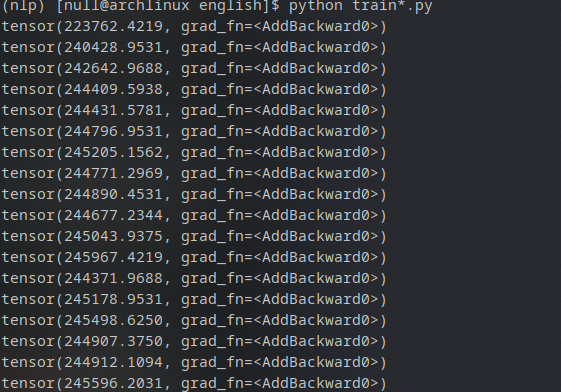

data/BBCnews_processed.db contains two tables, one containing preprocessed text and another containing pairs for training  
(integer, word) pairs in data/encoding_table.csv   
(integer, counts) pairs in data/word_occurrence.csv

  

